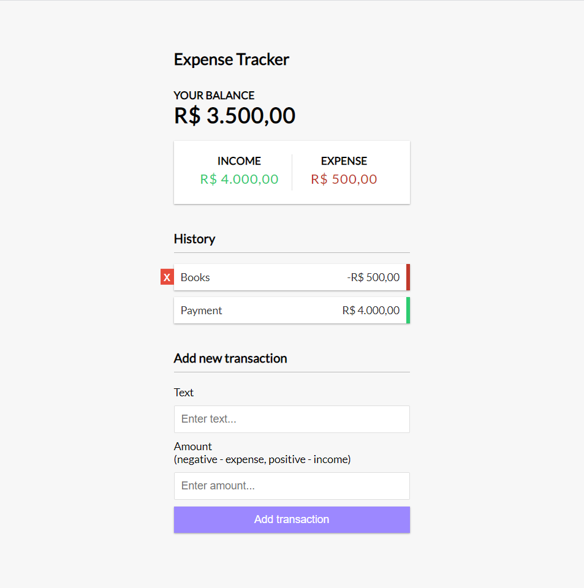

# Links

## YouTube

    https://www.youtube.com/watch?v=XuFDcZABiDQ

## Creator GitHub App

    https://github.com/bradtraversy/expense-tracker-react

## Video description

In this project we will take a vanilla JS expense tracker app and turn it into a React app using hooks (useState, useContext, useReducer) and the context API.

## Beautiful image \*-\*

Here we have a beautiful Expense Tracker App:

