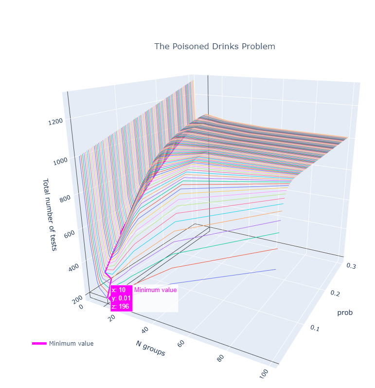
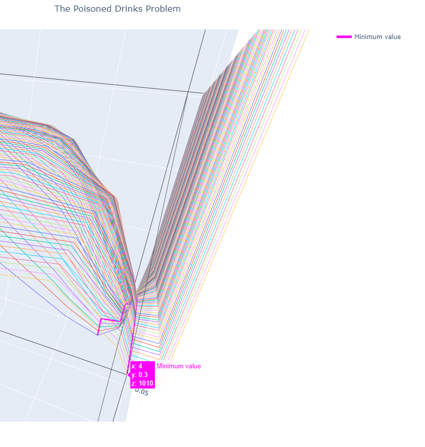
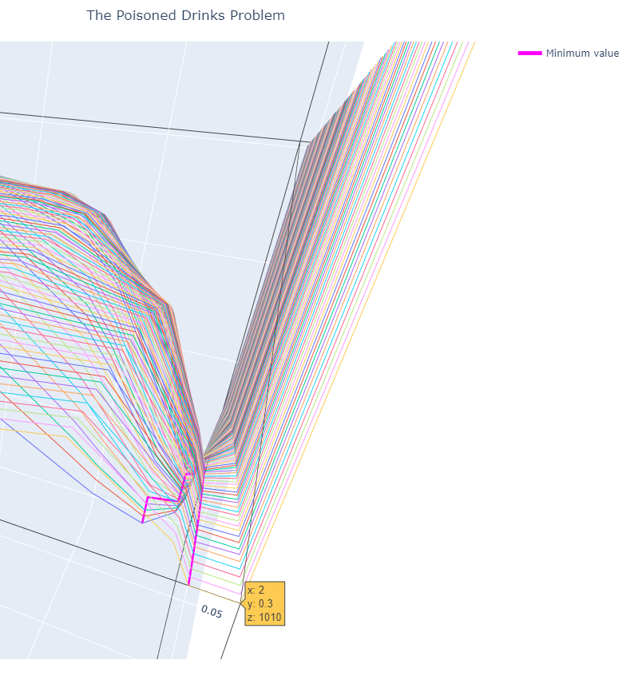

# Short HOW-TO
### Set up

* Python 3.8
* Windows 10 Pro
* Python

    * numpy==1.18.1
    * plotly==4.5.1
    * retrying==1.3.3
    * scipy==1.4.1
    * six==1.14.0

### Create/Activate/Deactivate Vitual Enviroment
This one is useful in case you don't want to share your global libraries.

Use the following command line:
    
```bat
    REM Create
    python -m venv venv
    REM Activate
    .\venv\Scripts\activate
    REM Do stuff
    REM ...
    REM deactivate
    deactivate
``` 

### Install libraries

```bat
    REM Installing stuff
    pip install -r requirements.txt
``` 

### Running this program

```bat
    REM Running!
    python main.py
``` 

### Beautiful image \*-\*

Here we have a beautiful minimum:


Look how cool! We've got two minimums here:
Optimization minimum             |  Minimum found by inspection
:-------------------------:|:-------------------------:
  |  
